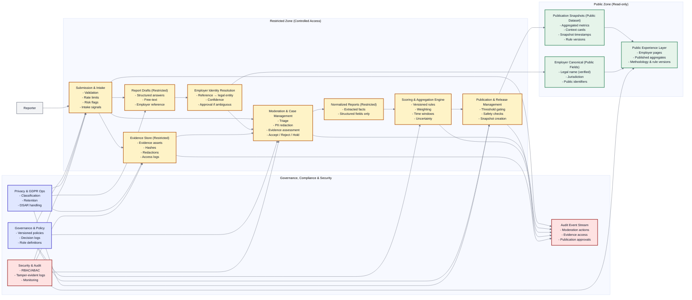
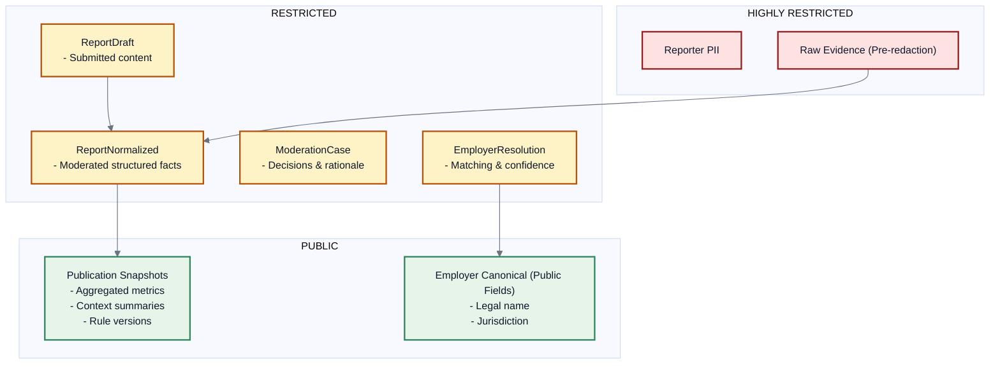
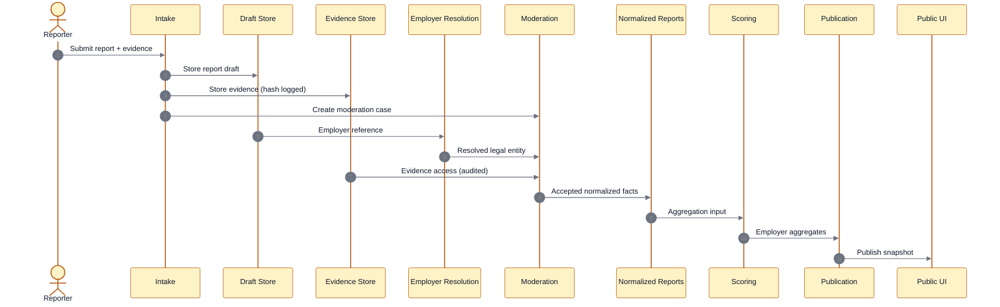

# JunkedOut – Logical Platform Architecture

This document defines the **high-level logical architecture** of the JunkedOut platform.
It focuses on **domains, trust boundaries, responsibilities, and data flows**.

---

## 1) Platform Logical Architecture (Modules & Data Flows)

---

## 2) Data Classification Boundaries

---

## 3) Submission → Publication Lifecycle

---

## 4) Architectural Invariants

- Legal employer (legal entity) is the **only canonical unit**.
- No raw submissions or evidence are ever public.
- Aggregates are computed **only from moderated, normalized data**.
- All decisions are **policy-versioned and auditable**.
- Governance, privacy, and security are **first-class domains**, not add-ons.
